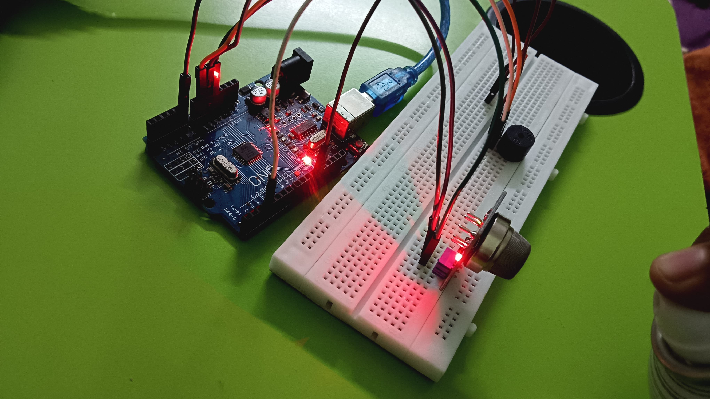
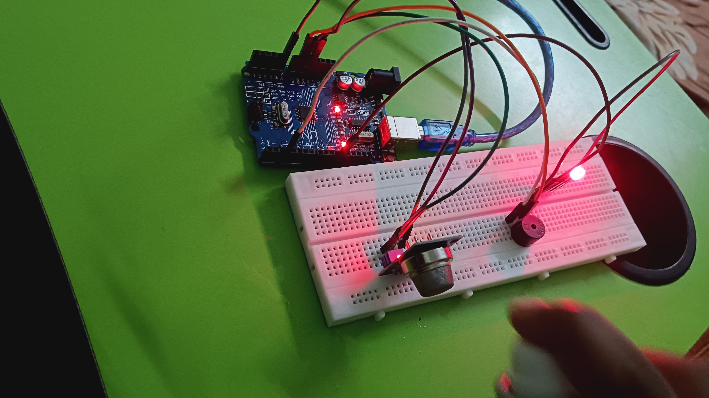

# Arduino-Based LPG Gas Detector 
An Arduino-based LPG/combustible gas detection project using an MQ-series gas sensor, status LEDs, a buzzer, and serial monitoring.

## Overview

The system reads the analog output of the gas sensor and compares the reading with a configurable threshold.

- **Safe condition:** Green LED ON, red LED OFF, buzzer OFF
- **Alert condition:** Red LED ON, green LED OFF, buzzer ON
- **Serial monitoring:** Sensor reading is printed at 9600 baud

> **Note:** The current implementation uses an analog threshold. The sensor value is not converted directly to LPG concentration (ppm), and the threshold should be calibrated experimentally for the particular sensor and environment.

## Hardware

- Arduino board
- MQ-2/MQ-6 gas sensor module
- Piezo buzzer
- Green LED
- Red LED
- Jumper wires and breadboard

## Pin Configuration

| Component | Arduino Pin |
|---|---|
| Gas sensor analog output | A0 |
| Buzzer | D8 |
| Green LED | D9 |
| Red LED | D10 |

## Working

1. The gas sensor provides an analog reading through **A0**.
2. Arduino reads the sensor using `analogRead()`.
3. The reading is compared with the configured threshold (`300` in the current code).
4. If the reading exceeds the threshold, the alarm state is activated.
5. Otherwise, the system remains in the safe state.
6. The sensor value is continuously displayed through the **Serial Monitor at 9600 baud**.

## Hardware Setup

### Setup Views

  
  

Additional hardware setup views are documented in the `images/` folder.

## Testing

Testing photos and project media are organized in the repository for documenting the hardware and working setup.

- Hardware images: `images/`
- Project videos: `video/`

## Code

Main Arduino sketch:

`code/LPG_Gas_Detector.ino`

## Project Documentation

- `documentation/Arduino-Based-LPG-Gas-Detector-Report.pdf` — project report

## Limitations

- The threshold is a project-level configurable value and should not be treated as a certified gas-safety limit.
- MQ-series sensors require appropriate warm-up and calibration for reliable measurements.
- The current code reports raw analog sensor values rather than calibrated gas concentration.

## Future Improvements

- Add a startup warm-up/calibration routine.
- Add an LCD/OLED display for local status and sensor readings.
- Add data logging for sensor trends.
- Add a calibrated concentration-estimation method where appropriate.
- Add a relay/exhaust-control interface with suitable electrical isolation and safety precautions.

## Author

**Aman Shukla**  
Government Polytechnic Saharanpur
