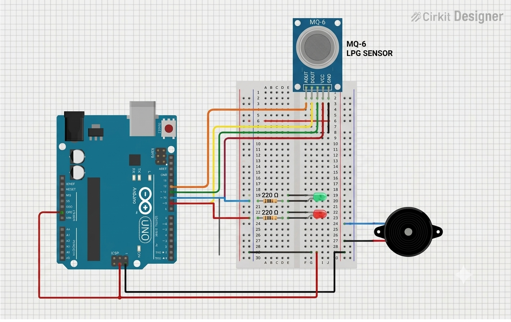
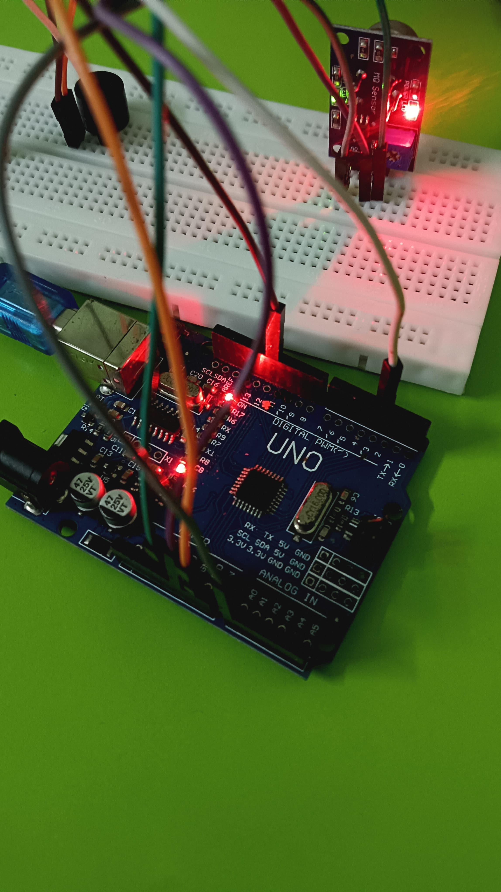

# Arduino LPG Gas Detector

A small Arduino project built around an MQ-6 gas sensor to detect changes in combustible gas levels and give a simple visual and audible warning.

The idea is straightforward: read the sensor value, compare it with a threshold, and change the LEDs and buzzer according to the reading.

## Hardware

- Arduino UNO
- MQ-6 gas sensor module
- Red LED
- Green LED
- Piezo buzzer
- Breadboard and jumper wires

## Connections

| Part | Arduino |
|---|---|
| MQ-6 analog output | A0 |
| Buzzer | D8 |
| Green LED | D9 |
| Red LED | D10 |

## Working

The MQ-6 gives an analog reading through **A0**. The Arduino reads this value once every second.

- Below the threshold → green LED ON, red LED OFF, buzzer OFF
- Above the threshold → red LED ON, green LED OFF, buzzer ON

The current threshold in the sketch is **300**. It is a practical value used for this setup and can be changed after checking the sensor's readings in the actual environment.

The sensor value is also printed to the Serial Monitor at **9600 baud**.

> **Important:** This is a basic threshold-based project. It does not measure LPG concentration in ppm and should not be treated as a certified gas-safety system.

## Circuit

  

## Hardware Setup

  
  
  

## Code

The Arduino sketch is available here:

**[LPG_Gas_Detector.ino](code/LPG_Gas_Detector.ino)**

## Testing

The assembled circuit was tested by monitoring the MQ-6 sensor value through the Serial Monitor and checking the LED and buzzer response when the reading crossed the threshold.

Testing video:

**[View testing video](video/mq6-lpg-gas-detector-testing.mp4)**

## Project Report

**[Open project report](documentation/Arduino-Based-LPG-Gas-Detector-Report.pdf)**

## Limitations

- MQ-series sensors need warm-up time and calibration for more consistent readings.
- The threshold depends on the sensor, circuit, and surrounding conditions.
- The project uses the raw analog sensor value rather than a calibrated gas concentration.
- It is intended as an educational embedded-systems project, not a safety-certified device.

## Possible Next Steps

- Add an LCD or OLED for local status and sensor readings.
- Add a proper warm-up and calibration routine.
- Log sensor readings for later analysis.
- Add a communication interface for remote monitoring.

## Author

**Aman Shukla**  
Electronics Engineering · Embedded Systems & Sensors
